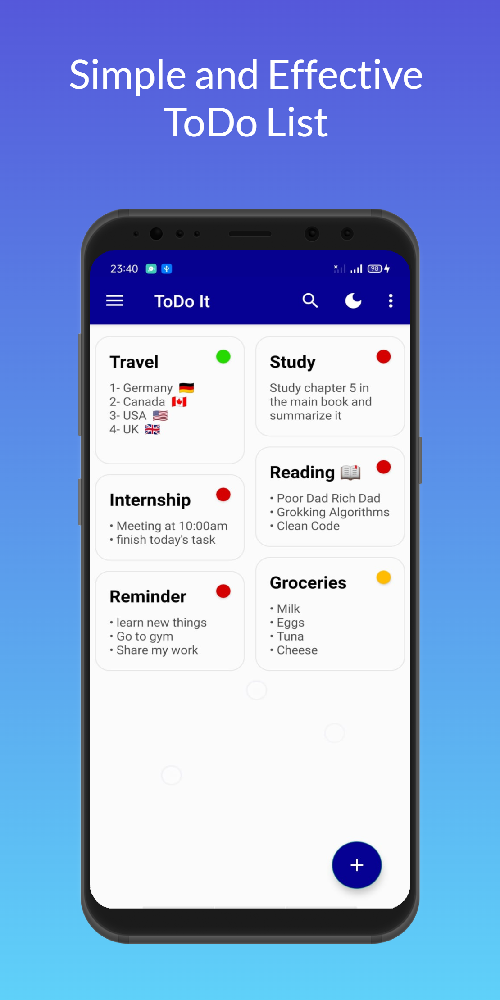
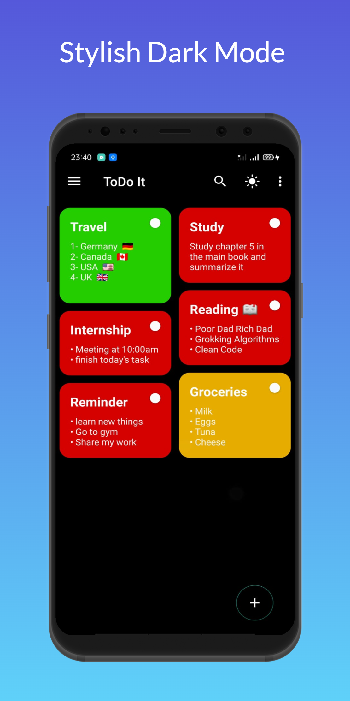
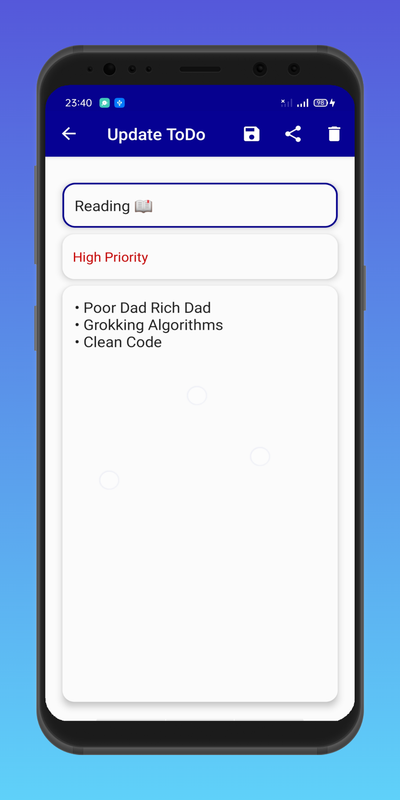
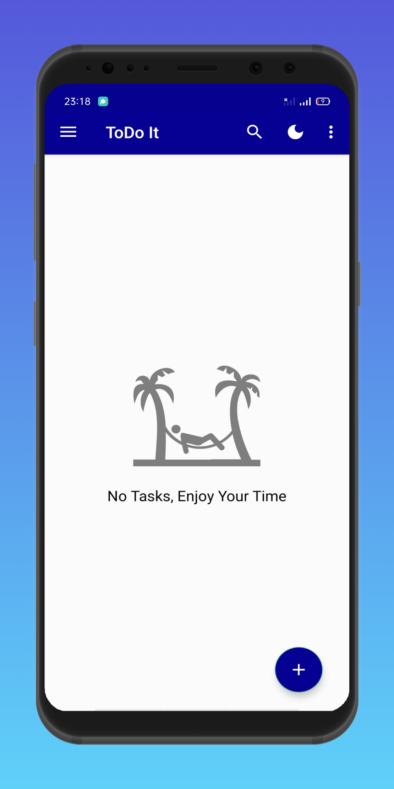
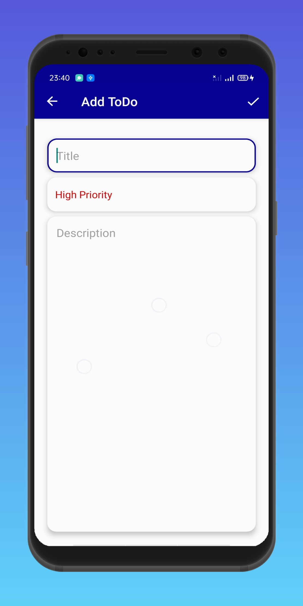

# ToDo It

# Description
• ToDo It is a smart task list for everyday use. 
• It is truly usable with a great user experience. 
• No matter who you are and what you do - you will be better organized.

# You Can:
1- Sort the todos by its priority. 
2- Search by todo title. 
3- Edit the todo content or priority. 
4- Delete the todo. 
5- Share your tasks with your friends. 

# Built with:
• Kotlin 
• MVVM Architecture 
• Room Database 
• Navigation Components 
• Coroutines 
• LiveData 
• Recycler View + Diff Util + Recycler Animator 
• Shared Preference 
• View Binding 
• Search View 
• I used the principle of single Activity and multiple fragments in the app 

# Screen Shots

https://user-images.githubusercontent.com/67869630/153723834-2c2e2ba8-a4c5-4fdb-a567-bedd7352de33.mp4

